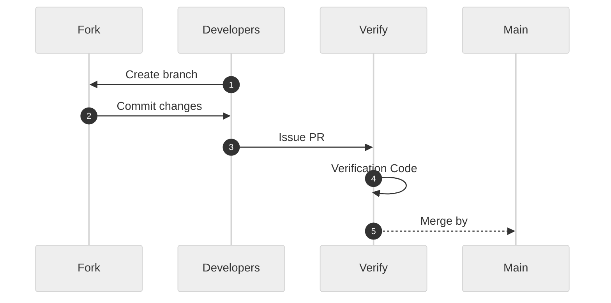

<!-- 品牌头图区块 -->
<div align="center">
  
  <br>
  <br>
  
  <p>Xone Chain is a modular Layer 1 blockchain that goes beyond scalability and efficiency. It focuses on ensuring every on-chain action creates tangible, traceable value.</p>
</div>

<br>

## 📦 Core Dependencies

| Category             | Technology Selection                                                                     | Version | Description of Purpose                 |
| -------------------- | ---------------------------------------------------------------------------------------- | ------- | -------------------------------------- |
| Front-end Framework  | [React](https://react.dev/)                                                              | 18.2.0  | Component-based Development Foundation |
| Build Tools          | [Vite](https://vite.dev/)                                                                | 5.1.6   | Modern Front-end Build System          |
| Web3 Integration     | [Wagmi](https://wagmi.sh/) + [Viem](https://viem.sh/)                                    | 2.8.4   | Multi-chain Wallet Connection Solution |
| State Management     | [React Query](https://handsonreact.com/docs/react-query) + [Valtio](https://valtio.dev/) | 5.35.1  | Data Flow Management                   |
| UI Component Library | [Chakra UI](https://chakra-ui.com/)                                                      | 2.10.4  | Customizable Design System             |
| Animation Library    | [Framer Motion](https://www.framer.com/)                                                 | 11.0.14 | Interactive Animation Implementation   |

<br>

## 🚀 Quick Start

### Environment Requirements

```bash
# Verify Environment Version
$ node -v
v18.16.0

$ pnpm -v
9.15.3
```

### Development Process

```bash
# 1. Clone Repository
git clone https://github.com/hello-xone/xone_website.git

# 2. Install Dependencies (Using pnpm)
pnpm install

# 3. Start Development Server
pnpm dev

# 4. Production Build
pnpm build

# 5. Local Preview
pnpm preview
```

### Code Standards

```javascript
// Component Naming Standards
function UserProfile() { /* ... */ }

// Hook Naming Standards
function useWalletConnection() { /* ... */ }

// File Structure Example
src/
├── components/
│ └── Header.tsx
├── hooks/
│ └── useNetwork.ts
└── pages/
└── Home.tsx
```

<br>

## 🤝 Contribution Guidelines

We welcome community contributions to make our Website as comprehensive and useful as possible. If you identify any inaccuracies, want to suggest an improvement, or contribute new content:

1. **Fork the Repository**: Create a personal copy of the repository to make changes.
2. **Make Your Edits**: Update and enhance the Website as needed.
3. **Submit a Pull Request**: After making updates, submit a pull request to propose changes to the official repository. Our team will review and merge approved contributions.

For more information about contributing, please see our [contribution document](https://docs.xone.org/study/contribut).

### Workflow



<br>

## 🌐 Official Channels

For any questions or support related to Xone Chian, please reach out to our support team:

**Official:** [hello@xone.org](mailto:hello@xone.org)

**Developers:** [developers@xone.org](mailto:developers@xone.org)

**Community:** [community@xone.org](mailto:community@xone.org)

**Support:** [support@xone.org](mailto:support@xone.org)

**Business:** [business@xone.org](mailto:business@xone.org)

**Community:** [Telegram](https://t.me/hello_xonechain) | [Developers Telegram](https://t.me/Xone_Developers) | [Twitter](https://x.com/xone_chain) | [Discord](https://discord.gg/UtFzuKNZ)

**News:** [Medium](https://medium.com/@xone_chain)

<br>

## 🏢 Contributors

Thanks goes to these wonderful people 🔥:

<div align="center">
  <span style="display: inline-block; margin: 5px;">
    <a href="https://github.com/steveliupai">
      
    </a>
  </span>
  <span style="display: inline-block; margin: 5px;">
    <a href="https://github.com/moretimeL">
      
    </a>
  </span>
  <span style="display: inline-block; margin: 5px;">
    <a href="https://github.com/Mangosagos">
      
    </a>
  </span>
  <span style="display: inline-block; margin: 5px;">
    <a href="https://github.com/xone-ggbond">
      
    </a>
  </span>
</div>

<br>

## 👀 Stats


<br>

## 📜 License Agreement

This project adopts the **MIT License**, with the following additional terms:

1. **Brand Protection**
   Derivative works must retain the original copyright statement and Xone brand elements

2. **Commercial Restrictions**
   This project is prohibited from being used in commercial scenarios that directly compete with Xone

3. **Modification Notice**
   Any major code modification requires adding a modification record to the file header:

```plaintext
// Modified by [Your Name] on [YYYY-MM-DD]
// Changes: [Briefly describe the changes]
```

<div align="center">
  
</div>
